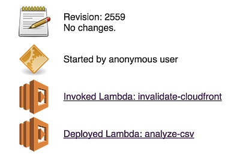

#AWS Lambda Jenkins plugin

Since the release of AWS Lambda in preview mode we wanted to use it to process event based flows. 
For one of our larger projects it immediately became clear that we needed asynchronous handling of files, isolated from the main api which we wanted to quickly respond to any client.

Instead of processing files for several seconds, blocking our users calls and reducing throughput, we decided to put the file on S3 and let AWS Lambda process it asynchronously.

After building and testing the Lambda function we wanted to integrate the function deployment into our continuous integration and deployment system using Jenkins. Command line tools including the AWS cli and Kappa where available but we wanted to limit the dependencies of our build servers.
That's why we decided to develop a Jenkins plugin for AWS Lambda that would allow us to deploy functions without further dependencies.

Currently the plugin can deploy and invoke functions as a build step and post build action. When invoking a function it is possible to couple the output to Jenkins environment variables.

Github link: [https://github.com/XT-i/aws-lambda-jenkins-plugin](https://github.com/XT-i/aws-lambda-jenkins-plugin)  
Jenkins wiki link: [https://wiki.jenkins-ci.org/display/JENKINS/AWS+Lambda+Plugin](https://wiki.jenkins-ci.org/display/JENKINS/AWS+Lambda+Plugin)

## Installation

Look for the AWS Lambda plugin in the available plugins after clicking "manage jenkins" and "manage plugins".

## IAM setup

For deployment you'll need access to the GetFunction, CreateFunction, UpdateFunctionCode and UpdateFunctionConfiguration Lambda commands.
You'll also need access to iam:PassRole to attach a role to the Lambda function. 

    {
        "Version": "2012-10-17",
        "Statement": [
            {
                "Sid": "Stmt1432812345671",
                "Effect": "Allow",
                "Action": [
                    "lambda:GetFunction",
                    "lambda:CreateFunction",
                    "lambda:UpdateFunctionCode",
                    "lambda:UpdateFunctionConfiguration"
                ],
                "Resource": [
                    "arn:aws:lambda:REGION:ACCOUNTID:function:FUNCTIONNAME"
                ]
            },
            {
                "Sid": "Stmt14328112345672",
                "Effect": "Allow",
                "Action": [
                    "iam:Passrole"
                ],
                "Resource": [
                    "arn:aws:iam::ACCOUNTID:role/FUNCTIONROLE"
                ]
            }
        ]
    }

For invocation you only need InvokeFunction:

    {
        "Version": "2012-10-17",
        "Statement": [
            {
                "Sid": "Stmt14328112345678",
                "Effect": "Allow",
                "Action": [
                    "lambda:InvokeFunction"
                ],
                "Resource": [
                    "arn:aws:lambda:REGION:ACCOUNTID:function:FUNCTIONNAME"
                ]
            }
        ]
    }

##AWS Lambda function deployment

After creating a job you can add a build step or post build action to deploy an AWS Lambda function

Due to the fact that AWS Lambda is still a rapid changing service we decided not to have select boxes for input.
The AWS Access Key Id, AWS Secret Key, region and function name is always required. All other fields depend on the update mode.

If the update mode is Code you also need to add the location of a zipfile or folder.
Folders are automatically zipped according to the [AWS Lambda documentation](http://docs.aws.amazon.com/lambda/latest/dg/walkthrough-s3-events-adminuser-create-test-function-create-function.html)  
For the Configuration update mode you need the role, handler and if you want to diverge from the defaults the memory and timeout values.  
When choosing the Both update mode, both UpdateFunctionCode and UpdateFunctionConfiguration is updated.

If the function has not been created before the plugin will try to do a CreateFunction call, which needs all fields previously mentioned in addition to the runtime value.
The update mode value is ignored if the function does not exists, but it will take effect for future builds if the function still exists.

##AWS Lambda function invocation

To invoke a function once again open up the add build step or post build action menu.

Again you need to add the AWS Access Key Id, AWS Secret key, region and function name. Optionally you can add a payload that your function expects.

If you enable the Synchronous checkbox you will receive the response payload that can be parsed using the Json Parameters.
You will also get the log output from Lambda into your Jenkins console output. 

The json parameters allow you parse the output from the lambda function if the json format is used. The parsed value will then be injected into the Jenkins environment using the chosen name.

Examples:

    {
        "key1":"value1",
        "array1": [
            {
                "arraykey":"arrayvalue"
            },
            {
                "arraykey":"arrayvalue2"
            }
        ]
    }
    
$.key1 => value1  
$.array1[1].arraykey => arrayvalue2

More info about JsonPath:  
github link: [https://github.com/jayway/JsonPath](https://github.com/jayway/JsonPath)  
try out expressions: [http://jsonpath.herokuapp.com/?path=$.store.book](http://jsonpath.herokuapp.com/?path=$.store.book)

These environment variables can be used as parameters in further build steps and actions which allow a Lambda function to have a deciding factor in the deployment process.

##Job build result

On the job build result page you'll get a summary of all deployed and invoked functions and their success state.

